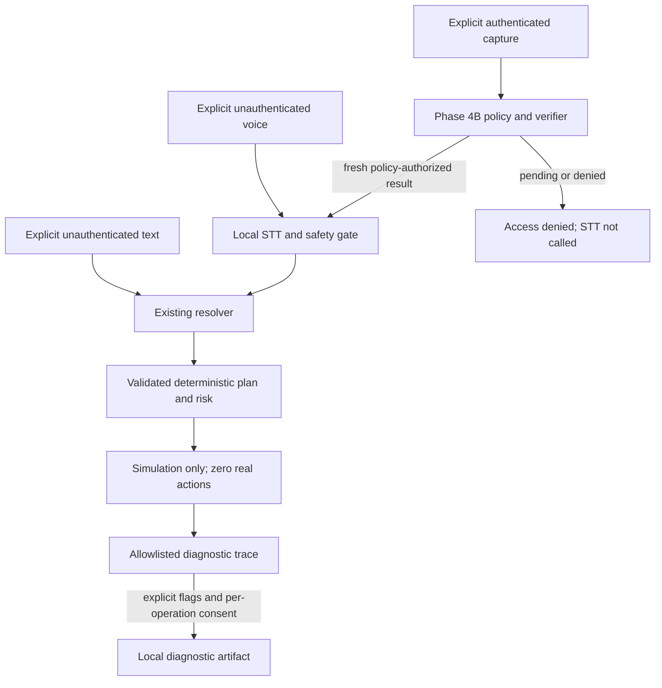

# Architecture

Implemented: Phase 1 foundation, Phase 2 explicit audio input, and Phase 3 local
speech-to-text. Phase 2 hardware checks succeeded per the user: device listing,
in-memory recording, WAV saving, cancellation and audio quality.
The user has manually tested Phase 3 and reported recognition mistakes and slow
first-run processing. These refinements are tested with fakes; real improvements
have not been measured.

Planned full pipeline:

Perceive ? Authenticate ? Transcribe ? Understand ? Retrieve Context ? Plan ?
Risk Check ? Execute ? Observe ? Verify ? Recover ? Respond ? Update Memory

Only audio input within Perceive and local Transcribe are implemented.
Authenticate and all later reasoning/action/history components remain planned.
The STT CLI demonstrates transcription without an authenticated execution path;
recognized text is displayed only and never executed.

Foundation: app/core/config.py provides side-effect-free validated configuration;
errors.py shared exceptions; logging.py safe fixed operational events.

Audio: app/audio provides the AudioRecorder protocol, typed PCM/results,
explicit discovery, bounded sounddevice capture, foreground terminal controls,
and separately requested WAV export. Capture remains in memory by default.

STT:
- contracts.py: replaceable SpeechToTextEngine protocol.
- models.py: requests, segments, optional word timestamps, safe errors and results.
- service.py: validates one selected PCM WAV or accepts RecordedAudio; checks
  bounds and prepares file PCM without scanning folders or persisting audio.
- faster_whisper_engine.py: lazy model loading, mono/16 kHz conversion,
  VAD/language/word options, segment consumption, timing and controlled errors.
- cli.py: explicit file transcription or Phase 2 capture followed by in-memory STT.

Model construction, downloads and device access never occur during module import
or settings loading. An explicit transcription can download model assets into
models/whisper; recognition itself uses local computation and never uploads audio.
Offline mode uses cached files only and rejects incomplete tokenizer snapshots.
The model is reused within the engine lifetime and released by dropping its
reference on close. Segment generators and in-memory WAV buffers are closed.

Results include correlation-ready UUIDs and timestamps but create no history.
Audio and transcripts never enter ordinary logs. CLI transcript display is
intentional user-facing output, not a logging or command-execution channel.

Tests inject fake models and capture adapters and generate WAVs in temporary
directories. Actual resampling/model compatibility, accuracy and latency require
manual STT checks. All future pipeline work requires separate phase approval.

## Phase 3 refinements

The STT microphone command defaults to record(None): the existing recorder uses
a configured safety maximum (120s default/hard cap) rather than a short CLI timer.
Enter stops; c/Ctrl+C discards; optional post-speech silence detection can stop.
RMS activity uses a configurable threshold and silence interval, counts frames,
resets on renewed activity, and retains captured trailing silence. It is off by
default. Capture remains explicit and in memory, with elapsed terminal display.

--seconds keeps an explicit bounded mode. --session keeps one service and lazy
engine alive across deliberate captures. The microphone is stopped while waiting
for a new start or while transcribing. No audio/history persistence is added.

The default model is small/cpu/int8. Configured beam size, temperature, VAD minimum
silence, word timestamps, initial prompt and hotwords pass to Faster-Whisper.
Vocabulary hints include VoicePilot, Spotify, WhatsApp, Chrome, YouTube and;
there is no lexical replacement layer. Raw transcript is exact segment-string
concatenation; normalized transcript only formats segment-boundary whitespace.
Both are serialized in the structured result; segments preserve raw text.

Separate clocks measure model load (including download/cache resolution),
inference (including full generator consumption), and total engine processing.
RTF uses total engine processing divided by source duration. The cold_start flag
describes whether this engine constructed or reused a model; it does not infer
cache/download state. File reading/capture/final cleanup are outside those totals.
Cancellation remains cooperative around native operations.

Silence, VAD and vocabulary bias can affect endings and multilingual speech.
Accuracy and speed are not guaranteed. No GPU or larger-model assumption is made,
and no new benchmark or improvement is claimed. Phase 4 remains unimplemented.

## Phase 3B: domain interpretation

app/commands is a text-only boundary independent of audio/model initialization.
models.py defines versioned dataset and resolution contracts; registry.py loads
explicit versioned vocabulary and intent templates; resolver.py performs
full-command matching and conservative entity suggestions. dataset.py validates
rows/schema; evaluate.py reports exact-count development metrics; cli.py exposes
resolve, validate-dataset and evaluate. None can execute proposals.

An existing STT result can be passed to resolve_stt, which consumes its unchanged
raw_transcript. Command normalization uses NFC, case-folding and punctuation/
whitespace handling for matching. Canonical command is a separate proposal;
it is not written back into STT. Heuristic scores never confer execution rights.

Exact unambiguous patterns can resolve; unknown, negated, compound, incomplete,
ambiguous and fuzzy input requires abstention/confirmation. Observed ASR errors
retain provenance and always require confirmation. No history, execution adapter,
speaker verification, LLM or frontend is introduced.

Versioned aliases and intent grammar are independent of the 80-row synthetic
seed. Tests block network, hardware/model imports and system-action functions.
Seed evaluation is not held-out research evidence or raw ASR accuracy.

## Phase 3C output gate

FasterWhisperEngine -> shared output_safety policy -> TranscriptionService (same
idempotent policy for every engine) -> successful STT only -> optional text proposal.
The engine collects optional segment no-speech/logprob metadata and bounds generator
consumption. The service uses actual PCM duration for length checks. All non-success
statuses are blocked by resolve_stt without reading transcript contents.
unusable_audio exposes empty transcripts and safe reason codes. Only bounded
numerical evidence is retained; cancellation discards it. No persistence,
execution or later-phase integration is added. Explicit text resolution bypasses STT
provenance. See decision 0005 for exact defaults, limitations and privacy boundaries.

### Numerical rejection evidence

SafetySummary is a frozen, allowlisted model with numbers, safe reason codes,
booleans and bounded numerical segment metadata only. OutputBudget collects evidence
before sanitization; output_safety attaches it on rejection. The service retains it
across its idempotent gate and uses actual PCM duration. The CLI displays reason codes
normally and the summary only with --safety-diagnostics. Rejected decoder text is
discarded, including private diagnostics. Cancellation clears the numerical summary. No rejection rules or thresholds changed for this observability work.

## Phase 3D shared audio preparation and controlled comparison

`audio_preprocessing.mono_pcm16` owns channel averaging and PCM round/clip behavior.
Both WAV decoding and engine preparation use it. `prepare_audio` owns PCM scaling,
existing decoder delegation, final dtype/shape/finite validation and C-contiguity.
The WAV container reader remains in the service; path validation wraps the shared
seekable-stream reader. Explicit disk saving and the BytesIO runner use the same
PCM16 writer. Neither stream codec opens a filesystem path itself.

The parity runner requires Enter consent, captures once, verifies exact WAV PCM16
preservation, and calls the service twice with direct and round-tripped inputs.
A comparison engine snapshots the actual prepared arrays immediately before model
loading/inference. One immutable settings snapshot forces cached-only loading;
one model instance is reused and branch order can be reversed. Source duration is
never replaced by resampled duration. Optional numerical duration_after_vad is also
retained on successful results, and cancellation clears it with other diagnostics.
No rejection policy changes are introduced.

Only numerical/structural comparisons and safe result metadata leave the runner;
no hashes, audio samples, files or history. Successful text requires an explicit
flag; rejected text never appears. Cancellation releases capture/result references
and clears numerical snapshots. Existing recordings are never inspected. Earlier
separate captures do not establish path inequality; synthetic fakes establish
routing parity only, and numerical equality cannot rule out backend nondeterminism.
No accuracy improvement is claimed or later project phase introduced.

## Phase 3E contextual evaluation boundary

`stt.context` validates a versioned public vocabulary and explicitly supplied private
overlay. The existing engine invokes its deterministic language-aware builder only
when contextual mode is enabled, using the already-loaded tokenizer. All STT entry
paths share this boundary. No missing tokenizer triggers a fetch.

`stt.refinement` returns a separate shadow object; raw/normalized STT contracts and
command resolver inputs are unchanged. Only reviewed whole-utterance courtesy
boundary proposals are supported, always with confirmation. No execution is enabled.

`evaluation.dataset` enforces selected private-root and consent/review/split metadata
boundaries. `evaluation.metrics` computes rates from temporary scoring copies.
`evaluation.stt` loads each explicitly consented PCM once for paired frozen A/B
settings, checks actual prepared-input equality, and reuses successful outputs for
C shadow and D raw resolver comparisons. E medium is a placeholder. Aggregate
reports contain numerical metrics and configuration only; private per-utterance
output requires explicit local authorization. No export/history or private directory
creation occurs. Public fixtures are fictional and fakes establish routing only.

## Phase 4A speaker boundary

`app/speaker/models.py` provides private-template/public-result contracts and
side-effect-free settings. `quality.py`, `embedding.py` and `thresholds.py` contain
numerical checks, immutable normalized vectors and bounded cosine decisions.
`enrollment.py` requires separate enrollment/persistence consent and consistent
3-5 sample aggregation. `verification.py` validates nominated profiles and model/
preprocessing/policy compatibility, then computes one safe verification result.

`profiles.py` is a bounded, atomic, externally rooted protected-file repository;
`protection.py` deliberately supplies only an unavailable production protector.
It creates no root, provides no DPAPI adapter and has no plaintext fallback or
profile cache. Tests use opaque tokens held by a fake protector, not encryption.
The future provisioner must establish restrictive ACLs before private writes.

`pipeline.py` binds a fresh verification request to an opaque audio ID and reuses
the exact original audio buffer for STT. Only verified, validated-policy results
reach the safety-applying TranscriptionService and non-executing resolver. All
other statuses, mismatches, cancellation and backend errors fail closed. Ordinary
pipeline dumps exclude downstream text. There is no boolean authorization input,
text-entry path, saved-result authorization or execution dependency.

`antispoof.py` returns unavailable, never liveness. `evaluate.py` handles synthetic
trial counts, denominator-explicit rates, EER interpolation and split checks.
`cli.py` exposes safe metadata/schema/synthetic commands; real operations remain
unavailable. Real model/protector/calibration provisioning belongs to Phase 4B.

The existing disabled speaker flag and nested `VOICEPILOT_SPEAKER__...` settings do
not activate a backend. Existing diagnostic CLIs preserve Phase 1-3E behavior.
See decision 0007 for exact defaults, privacy, lifecycle and research limitations.

## Phase 4B local speaker verification

Phase 4B supersedes the Phase 4A unavailable runtime/protector descriptions above.
The pinned WeSpeaker model runs locally through sherpa-onnx 1.13.8. Explicit CLI
workflows provide enrollment, verification and private calibration; current-user
Windows DPAPI protects profiles and records outside Git/OneDrive, without plaintext
fallback. Calibration evidence and reviewed policies bind to the exact enrollment.
Successful re-enrollment resets authorization; failed replacements preserve it.
Defaults remain disabled/pending. No microphone testing or real enrollment was
performed during implementation, and no execution or anti-spoofing is implemented.

See [decision 0008](docs/decisions/0008-real-local-speaker-verification.md) for the
model source/licence/hash, configuration, security limits, evaluation and exact manual
commands. `inspect-status`, `inspect-model`, `smoke-backend` (generated sine wave),
`smoke-dpapi` (fixed marker), and `evaluate --synthetic` do not capture a microphone.

## Phase 5A planning and diagnostic boundary

`app/planning` contains strict plans/configuration, a closed data-only capability
registry, deterministic risk rules and resolver-checked templates, explicit expiring
single-use simulation confirmations, simulated observation/verification/recovery,
and labelled synthetic evaluation. No executor implementation can perform actions.
Arguments are closed identifiers; generated text cannot select handlers or imports.
Every capability, plan, step and result denies execution.

`app/pipeline` separates trace models, orchestration, consent-controlled artifact
storage and the readable/JSON CLI. The two unauthenticated entry points are development
diagnostics only. Authenticated inspection delegates to the established Phase 4B
protected-policy and VerificationService boundaries; pending policy blocks STT.
A successful authorized flow reuses the exact captured buffer and fresh audio ID.

Raw/STT-normalized/resolver-normalized/canonical/proposed forms remain distinct.
Private text is omitted by default. Traces never contain biometric evidence or
private STT segments. Artifact persistence is bounded, UUID-selected, no-overwrite,
atomic and explicit; it is not a history database. No automatic startup/capture,
model download, retention or directory creation is introduced. See decision 0009.

## Phase 5B fake execution-control boundary

`app/execution` adds independent typed models, immutable adapter metadata, an
instance-local synthetic evidence authority, controller/state machine, independent
FakeWorld observer, safe audit events and synthetic evaluation/inspection CLI.
`Controller.run` always blocks production execution; only `run_fake` exercises
synthetic fixtures. No Phase 5A pipeline invokes it and no speaker/model is loaded.

Admission consumes plan/step/argument/policy-bound evidence before adapter entry.
Independent observation and verification are mandatory for fake success. Shared
authority and controller ledgers protect logical-step idempotency. Emergency stop
latches cancellation; bounded retry applies only to idempotent fake effects.
Rollback is claimed only after independent restoration observation. Audit events
contain no transcript, entity value or biometric evidence and are never persisted.
See decision 0010 for the state graph, limitations and future production boundary.

## Phase 6A launch extension

The earlier phase descriptions above are historical. `app.launch` now supplies a
separate closed Windows launch path. `allowlist` owns fixed identities; `windows`
validates held candidates and independently observes processes; `winapi` lazily
wraps native APIs; `authorization` binds manual or protected authenticated evidence;
`controller` uses the Phase 5B adapter contract and state transitions; `cli` exposes
inspection and deliberate manual consent. Settings.launch defaults production off.
Existing diagnostics, fake execution and simulation remain non-executing. No new
persistence or dependencies. See decision 0011 for the full boundary and limitations.

## Phase 6B basic operations boundary

`app.commands.basic` -> separate immutable `app.operations.models.Plan` -> closed
registry/risk policy -> expiring single-use manual authorization -> operations
controller -> fixed state/screenshot adapter -> independent observation/verification.
The controller reuses Phase 5B Machine transitions; existing diagnostic/simulated plans
remain rejected. Windows APIs are lazy and fixed, with real controls and screenshots
default off. Native brightness mutation is unsupported. Session audit is a bounded
in-memory event deque; screenshot storage is a separate consented local artifact store.
`app.execution.cancellation` joins active capture/STT/diagnostic/execution/launch/basic
work in one process, with cooperative cancellation and a latched emergency stop.
Authenticated voice commands deny before capture/STT and cannot issue authorization.
See [decision 0012](docs/decisions/0012-controlled-windows-basic-operations.md).

## Phase 6B.1 owner pilot

`app.owner` adds a separate, protected personal calibration protocol without profile
migration. `calibration` owns evidence separation/frozen thresholds/lifecycle; `challenge`
owns one-use expiring closed phrases; `storage` uses existing DPAPI and restricted private
roots. `pilot` preflights calibration, verifies a prompted capture, verifies the separate
command speaker, applies STT safety and a closed deterministic grammar, then mints one
exact-plan permit for the existing launch/operations controllers. Each native guard
rechecks current profile/calibration/model binding and expiry. Ordinary diagnostics and
simulation cannot mint these permits. `runtime` constructs local dependencies lazily;
`cli` requires explicit interactive consent and Enter per capture. See decision 0013.
