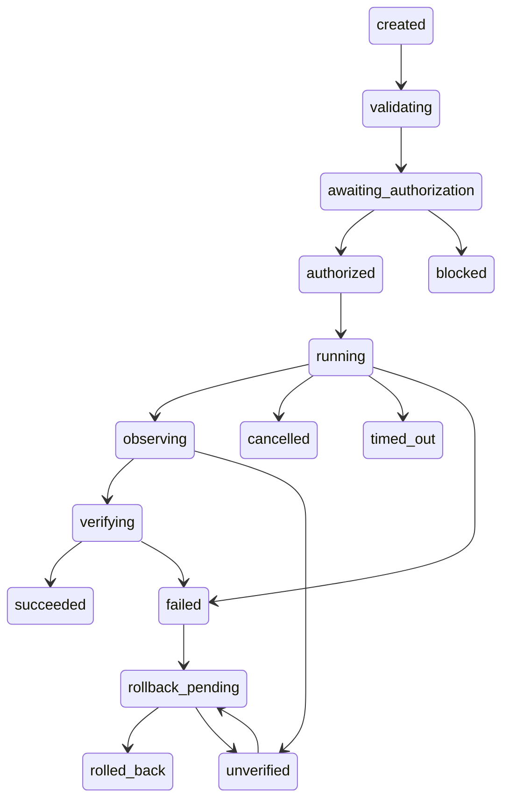

# 0010: Controlled execution foundation with in-memory fakes

Phase 5B adds execution-control contracts and a synthetic test harness. Production
execution remains globally disabled: Controller.run always returns blocked/disabled.
No production adapter or authentication issuer exists. No existing diagnostic path
is connected to the new package. Phase 5A plans/results keep execution disabled.

## Authorization boundary

FakePlan is a separate synthetic fixture type, with closed arguments, capability IDs,
step IDs, version and expected condition. Existing planning.Plan, simulator results,
plain dictionaries and booleans cannot be promoted into execution authority. Only
registered application.launch and media.play capabilities have fake adapters. Unknown
capabilities, prohibited risk, unsupported arguments and arbitrary paths/code/URLs are
rejected. No plan field selects an import, class, function or executable.

FakeAuthority is explicitly a trusted synthetic harness. Its synthetic_authentication
method creates only instance-local fake evidence for a synthetic plan; status must be
verified and calibration validated. Pending/rejected/unavailable inputs fail closed.
This is NOT a bridge to real Phase 4B speaker authentication and is not proof of a
person's identity. No speaker profile/model/audio is read. A future production issuer
must use the existing protected Phase 4B approved-policy and fresh verifier boundary,
including current enrollment provenance, global authorization policy and additional
factors where appropriate. No such production issuer is supplied in Phase 5B.

Every issued request binds the exact plan ID and complete plan digest, step ID and
complete step digest, capability, typed arguments, authentication and confirmation
IDs, fixed policy version, UTC expiry and single-use nonce. Digests include arguments
and versions. SHA-256 is only an integrity identifier; it is not encryption, identity
proof, or authentication. Authority comes from matching an unconsumed in-memory record
in the issuing FakeAuthority instance. An arbitrary copied/edited request or new issuer
cannot validate evidence merely by supplying a digest or UUID.

The explicit confirmation challenge presents the exact synthetic side effect and
structured step/arguments for deliberate review. Only approve_fake_effect accepts it;
booleans and generic yes/accepted values do not. A challenge is expiring and single-use;
a changed plan/step, rejection/cancellation, reused challenge or reused confirmation
cannot approve another operation. All registered fake effects require confirmation.
Prohibited plans cannot obtain challenges or authorization. Phase 5A simulation
confirmations are not accepted by this authority.

Authentication and confirmation handles are consumed when issuing a request. Request
handles are consumed atomically before admission, including failed matching attempts.
Unexpired tokens remain bound to their full original record. Handles/digests/arguments
are excluded from routine repr and serialization, and never enter audit events.
These are in-process capabilities, not signed distributed tokens. Trusted Python code
with access to process internals is outside this boundary.

## Controller and state machine

The execution state machine rejects invalid transitions. Typical verified fake work:



Additional cancellation/timeout exits exist at active boundaries. Repeated running is
allowed only for bounded retries. Production run cannot enter this path; run_fake
requires synthetic fixture and issuer objects. Fake success always carries fake=true,
execution_permitted=false and real_actions=0. Configuration cannot enable production.

Adapter contracts cover capability/input schema, preconditions, execute, advisory
observation/verification, rollback declaration, idempotency and cancellation. The
immutable registry selects fixed in-memory FakeAdapter implementations only. No
subprocess, shell, browser, filesystem, network, mouse, keyboard or microphone adapter
exists. All state changes are dictionary updates in FakeWorld.

The controller deliberately ignores adapter-supplied observation/verification claims.
An IndependentObserver reads FakeWorld directly and verifies the expected condition
against the pre-operation snapshot. Adapter_returned is distinct from
observation_available and verified_success. A success return without the correct
state never becomes succeeded. Missing observations remain unverified. Result models
reject succeeded without verified_success evidence.

Launch's synthetic assignment is idempotent; play's synthetic increment is not.
Only idempotent work can retry, with at most max_retries + 1 attempts (maximum four).
Non-idempotent work gets exactly one attempt. Logical plan/step IDs are reserved before
work and cannot be repeated with new tokens. Both controller-local admission and a
shared authority ledger prevent duplicates, including across controllers using the
same authority. Evidence/ledger sizes are bounded and fail closed at capacity. No
history database or persistence is created; restarting an authority loses its state.
Future real execution needs durable idempotency and crash recovery.

Emergency stop latches for the controller lifetime, blocks new work and signals the
active cancellation Event without waiting for the work lock. Concurrent/reentrant
admission is rejected. Cancellation/deadline checks surround fake execution,
observation, verification and rollback. Time budgets include cumulative elapsed time
and synthetic timeout costs; retries do not reset the deadline. Fake methods are
bounded and nonblocking. This cooperative design cannot forcibly interrupt arbitrary
blocking or malicious Python: real adapters require process isolation and watchdogs.
A timeout/cancellation never claims that side effects were rolled back.

Rollback return values are insufficient. The independent observer must verify that
state matches the prior snapshot before rolled_back is reported. A lying/failing
rollback or unavailable observation yields unverified. In-memory restoration has no
implication for reversibility of real applications. Exceptions yield safe failure
results without propagating arbitrary adapter messages.

## Privacy and configuration

Audit events are bounded per-request, in memory only: event UUID, UTC time, plan/step
IDs, capability, previous/new state, safe reason, duration, fake marker and disabled
execution flag. They exclude transcripts, entity values, arguments, audio, profiles,
embeddings, similarity, biometric provenance, credentials, arbitrary exceptions and
personal paths. There is no audit-save command, database or new persistence format;
.gitignore needs no new rules. Existing diagnostic artifact ignores remain intact.

Settings.execution is separate from planning and speaker configuration. Defaults:
enabled=false (immutable), fake_only=true (immutable), policy_version=5b-v1,
timeout_seconds=5 (maximum 30), max_retries=1 (maximum 3), evidence_ttl=60 (maximum
300), max_entries=1000 (maximum 10000). No model, threshold or dependency changed.
Imports/configuration do not read profiles, load models, open devices or create files.

## Safe inspection and validation

All commands below operate only on built-in synthetic state/metadata:

```powershell
.\venv\Scripts\python.exe -m app.execution.cli status
.\venv\Scripts\python.exe -m app.execution.cli registry
.\venv\Scripts\python.exe -m app.execution.cli evaluate
.\venv\Scripts\python.exe -B -m pytest tests/execution -q
.\venv\Scripts\python.exe -B -m pytest tests/planning tests/pipeline -q
.\venv\Scripts\python.exe -B -m pytest tests/speaker tests/stt tests/commands -q
.\venv\Scripts\python.exe -B -m pytest -q
```

The 20 independently labelled development cases cover valid fake work, plan mutation,
expiry, token/confirmation replay, missing consent, prohibited risk, pending calibration,
policy mismatch, booleans, adapter failure, false adapter success, missing observation,
verification failure, cancellation, timeout, rollback failure/false claims, exceptions
and transient failure. Cases are source-defined synthetic fixtures with no personal
content or audio. Evaluation reports exact numerators and denominators:

- blocked unsafe requests: 9/9;
- authorization bypasses (unsafe authorization cases that reached an adapter): 0/7;
- confirmation bypasses (missing/replayed confirmation reaching an adapter): 0/2;
- replay rejection: 2/2;
- verified-success correctness across all labelled outcomes: 20/20;
- false success (unexpected success or success without verification): 0/20;
- fake-only enforcement: 20/20.

Two cases expect verified success. These are development tests, not held-out research,
real speaker accuracy or empirical OS security guarantees. The tests actively deny
filesystem access/mutation, subprocess/application launch, network/browser access,
input control and hardware/model imports. Compatibility suites retain existing fake
and temporary-directory fixtures. Baseline before Phase 5B was 1,085 passing tests.

## Phase 6A requirements (proposal only)

Separately approve narrowly allowlisted Windows application launching, explicit OS
permissions and independently reviewed executable discovery (never dictated paths).
Require a real authorization issuer tied to approved current Phase 4B policy and
fresh authentication, exact side-effect confirmation, isolated adapters/watchdogs,
independent OS observations, durable idempotency, crash recovery and honest rollback
semantics. Reassess spoof resistance/additional factors and privacy before deployment.
No Phase 6A, browser/Spotify control, wake word, TTS, frontend, permanent history or
LLM integration is implemented or authorized by this decision.
